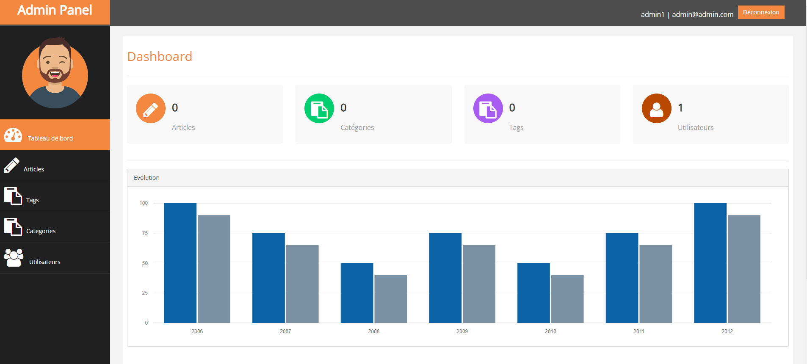
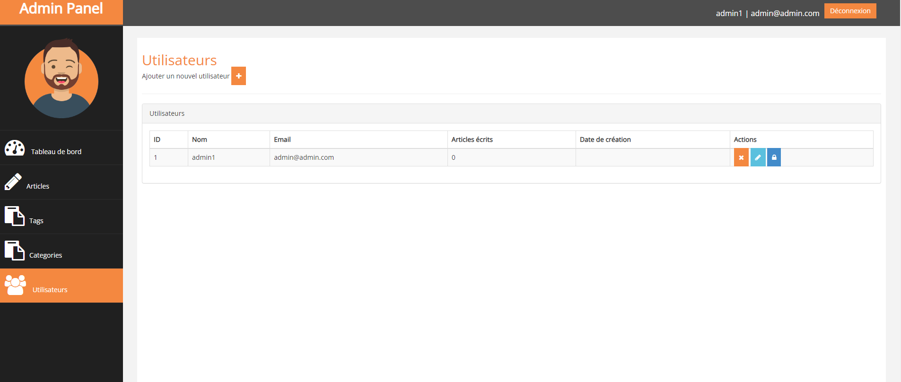
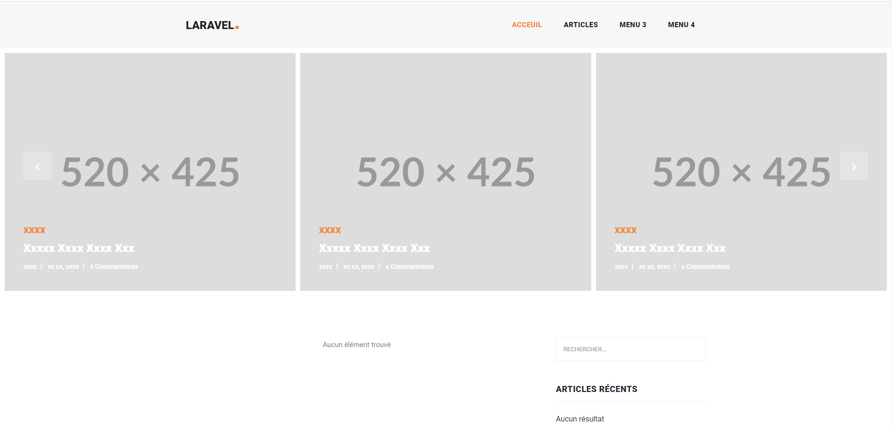
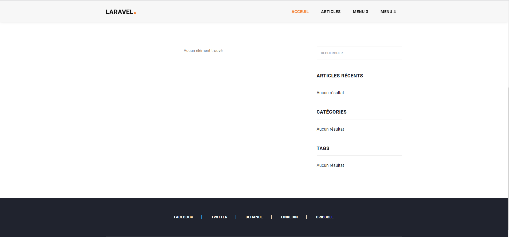
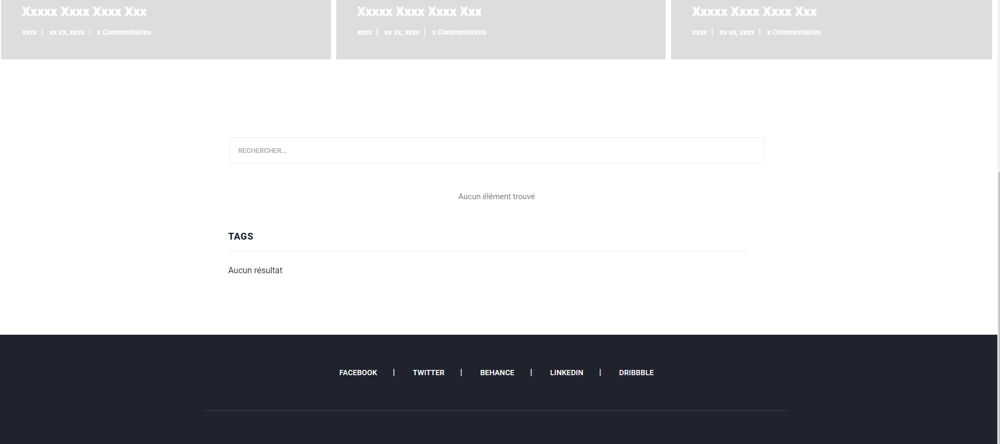

# LaraTodo
This is a simple Blog I created using just Laravel !







# This has the following features

- Read articles
- Add articles
- Edit articles
- Search for articles by name
- Search for articles by category
- Search for articles by tag
- Share articles on social media

# What's left ?

I have still have to add some additional features as :

- Authorization system
- Install disqus comment system
- Add little graph in the dashboard
- Add a final touch in the web design


# Installation


```sh
1)Install Composer In Your PC

2)Clone Or Download The Repository

3)Goto The Repository and Open a Terminal Enter Following Commands 
    composer install

4)Execute the Following Commands
    copy .env.example .env (for Windows)
    php artisan generate:key
    php artisan migrate
    php artisan serve
    
5)Enjoy !!!
```


Verify the deployment by navigating to your server address in
your preferred browser.

```sh
127.0.0.1:8000
```


